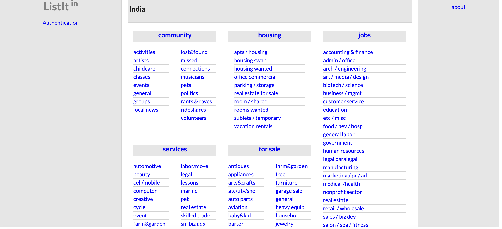
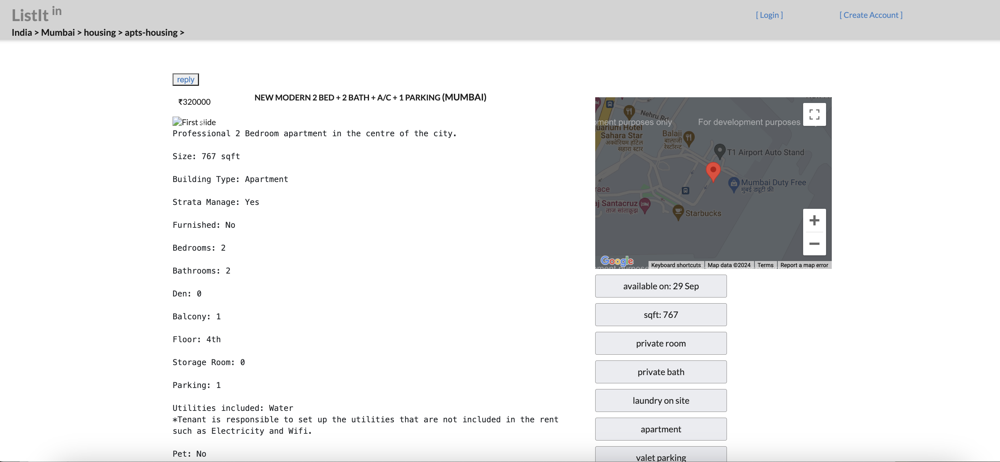
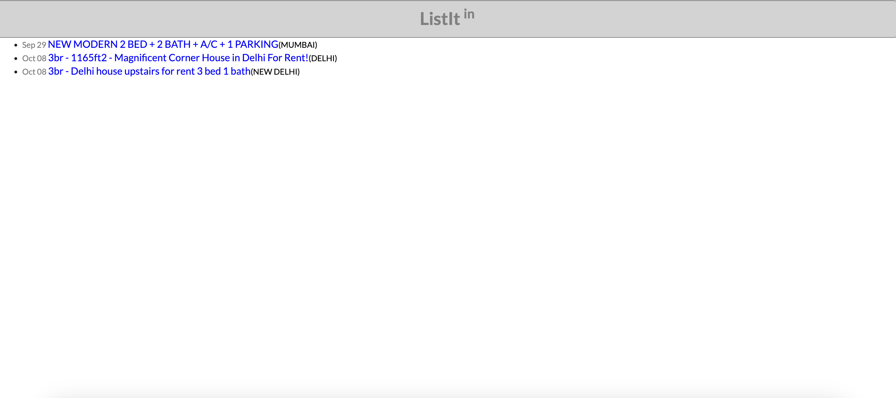
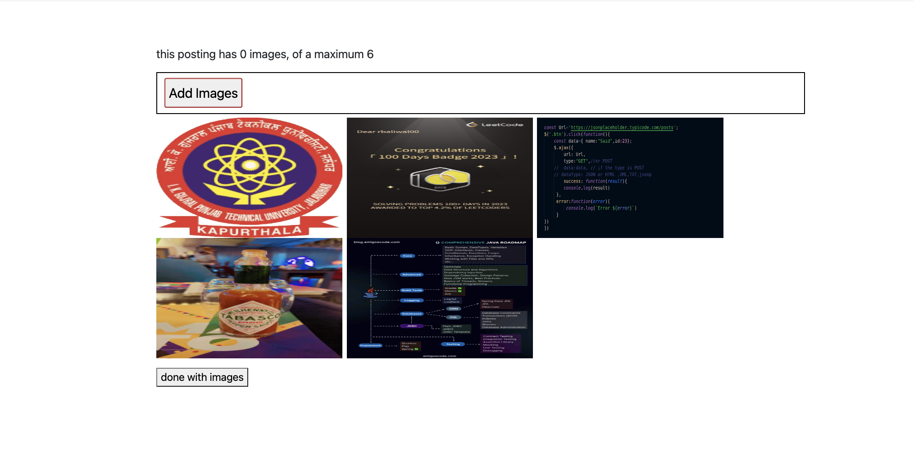
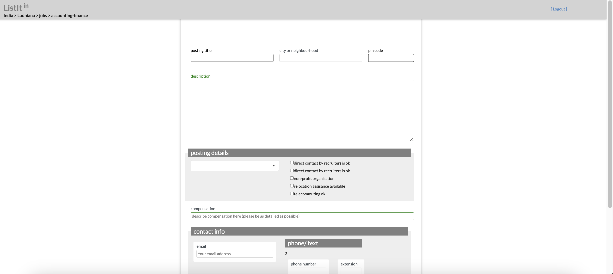
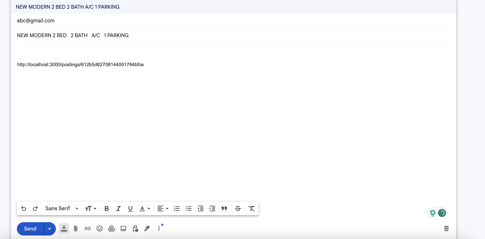
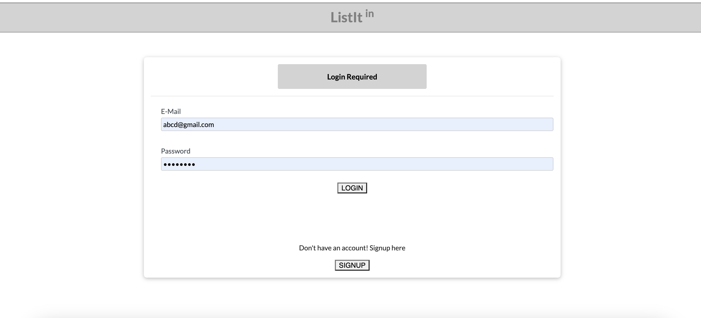
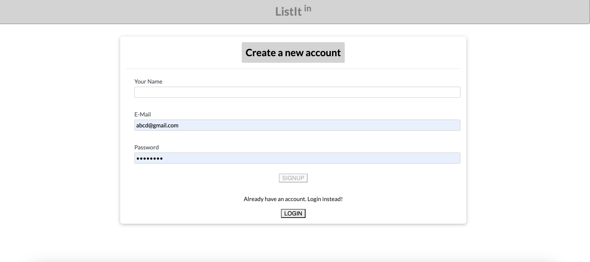

<h1 align="center">
  List It - An advertisement web application
</h1>

It is an advertisement system that allows users to create advertisements while other users can view these advertisements (location, photos, contacts, etc.)

## Tech Stack

This project is built using a modern tech stack that includes **ReactJs**, **NodeJs**, **Express**, **MongoDB**, **Google Cloud** and **Google Maps**. Each technology is chosen to fulfill a specific purpose in the project.

## Features

- **Implemented a advertise creation api.**
- **Authentication using JWT.**
- **Added the Google Maps feature.**
- **Implemented Google Cloud Storage Buckets for multiple image uploading.**
- **Implemented custom exception handling and validation.**
- **Used address to fetch Longitude and Latitude using Google Maps API**
- **Can reply to advertisements using mails**

## Example Images

Homepage

Post

All Posts

Multiple Image Upload

Form

Reply

Login

Sign Up
